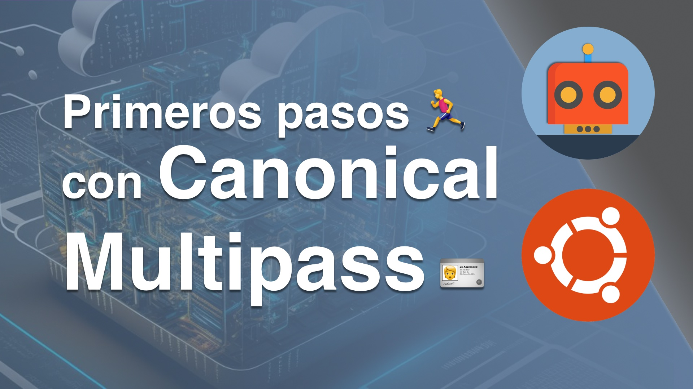

# Primeros pasos 🏃con Canonical Multipass 🪪

Hoy vamos a hablar de Multipass, una herramienta de Canonical con la que podras emular la nube en local!

**Video:**

0:00 Inicio

0:15 INTRO

0:42 Que es Multipass?

01:21 Instalacion

03:12 Básico

6:28 Instancia Primary

08:35 Lanzar una instancia nueva

12:52 Recuperar una instancia

14:40 Montar unidades o directorios

19:48 Instancia con Cloud-Init

24:32 Conclusión

25:08 Despedida

25:17 OUTRO

GitHub:
https://github.com/TheAutomationRules/multipass/blob/main/Video_01/README.md

Twitter: @TheAutomaRules
Instagram: TheAutomationRules

#multipass #canonical

---

## How2Use

- Clona este repositorio ej: **git clone https://github.com/TheAutomationRules/multipass.git**
- Entra al directorio del video desde tu interprete de comandos ej: **cd multipass/Video_01/**

Ahora si comencemos, ve al video y no te pierdas ni un segundo!

**IMPORTANTE! No te olvides de subscribirte y compartir, esto me ayuda y anima mucho a seguir haciendo contenido!**